# MCP Architecture & Workflow

This document explains the Model Context Protocol (MCP) architecture as implemented in **NaviGravity**.

## 1. What is MCP? (The "Universal USB" for AI)

Think of MCP as a **"Universal USB" for AI**.
Before MCP, connecting an LLM like Claude/Gemini to Navidrome would require complex custom integrations. With MCP, you create a standard "driver" (your Python server), and any compatible AI (the Client) can use it immediately without knowing the internal implementation details.

**Key Concept**: The AI doesn't "think" about the raw data; the AI **uses Tools** that you provide via MCP.

## 2. Architecture Components

There are 3 main actors in this system. Here is the data flow:

```mermaid
graph TD
    Client["🖥️ MCP Client<br>(macOS / Claude Desktop / IDE)"]
    Server["🐍 MCP Server Process<br>(Local Python Script)"]
    Service["🎵 External Service<br>(Navidrome API)"]

    Client -- "1. Spawn Process (stdio)" --> Server
    Client -- "2. 'What tools do you have?'" --> Server
    Server -- "3. 'I have: search, create_playlist...'" --> Client
    
    Client -- "4. User: 'Make me a rock playlist'" --> Server
    Server -- "5. HTTP Request" --> Service
    Service -- "6. JSON Data" --> Server
    Server -- "7. Structured Result" --> Client
```

### The Components

1.  **The Client (The Brain)**: This is the application you use (e.g., Claude Desktop App, Cursor, VS Code).
    *   *Where does it run?* On your local machine (Mac).
    *   *Role*: It is the User Interface. It decides **WHEN** to call a function.

2.  **The Server (The Arms)**: This is your `navidrome_mcp_server.py` script.
    *   *Where does it run?* **LOCALLY**, on your Mac. It is launched "under the hood" by the Client as a subprocess.
    *   *Role*: It exposes functions (`@mcp.tool()`) and translates the AI's intent into real API calls to Navidrome.

3.  **The Service (The Real World)**: This is your Navidrome server.
    *   *Where does it run?* Anywhere (NAS, VPS, Local Docker).
    *   *Role*: Executes the actual work (streaming music, saving playlists, DB queries).

## 3. Local vs. Remote Topology

A common point of confusion:

*   **The MCP Server (Python) is LOCAL**: In the standard configuration (`stdio` transport), the JSON config tells the Client: *"Run this command on my computer to start the server"*. The Python process runs on your Mac while you chat.
*   **Navidrome is (often) REMOTE**: The local Python script makes HTTP requests to your Navidrome instance (which could be in your basement or on a cloud server).

> **Therefore**: You do not need a server "listening" on a public port for MCP. The Client launches the script as a subprocess. It is secure and local to your PC.

## 4. Remote Connections (SSE Transport)

If you need to connect from a remote IDE (e.g., connecting a cloud-based IDE to a local server, or vice versa), you need the **SSE (Server-Sent Events) Transport**.

*   **Stdio (Default)**:
    *   **Pros**: Zero network config, secure, simple. The client "spawns" the server.
    *   **Cons**: Server must live on the same machine as the Client.
*   **SSE (HTTP)**:
    *   **Pros**: Allows distributed architecture (e.g., Claude on Mac, MCP Server on Raspberry Pi).
    *   **Cons**: Requires running the script as a web server (e.g., port 8000), managing firewalls, and security.

**Recommendation**: Stick to **Stdio** for development (keeps everything local or uses SSH tunnels for the Navidrome connection).

## 5. Execution Workflow

The "lifecycle" of a request:

1.  **Startup**: You open the Client (e.g., Claude Desktop).
2.  **Handshake**: The Client reads the JSON config and runs `python .../navidrome_mcp_server.py`.
3.  **Discovery**: The script responds: "Hello, I can do `create_playlist`, `search_music`, etc.".
4.  **Prompt**: You type: *"Make me a focus playlist"*.
5.  **Reasoning**: The AI thinks: *"The user wants a playlist. Do I have a tool? Yes, `create_playlist`, but I need songs first..."*.
6.  **Tool Call**: The AI sends a request to your script: `Execution Request: get_tracks_by_mood(mood="Focus")`.
7.  **Execution**: Your script calls the Navidrome API, gets the songs, and returns JSON to the AI.
8.  **Response**: The AI tells you: *"I've created a playlist with 20 Focus tracks!"*.
